# ĐẠI HỌC BÁCH KHOA HÀ NỘI
## TRƯỜNG CÔNG NGHỆ THÔNG TIN VÀ TRUYỀN THÔNG

***

# BÁO CÁO BÀI TẬP LỚN
## ĐỀ TÀI: WEB HỌC TIẾNG ANH (HÀ MÃ)

* **Học phần:** Phát triển phần mềm theo chuẩn kỹ năng ITSS
* **GVHD:** ThS. Nguyễn Mạnh Tuấn
* **Nhóm thực hiện:** Nhóm 02

### Danh sách thành viên:
1. **Quách Hoàng Anh** - MSSV: 20184039
2. **Đinh Thị Ngân** - MSSV: 20184164
3. **Nguyễn Thị Cẩm Li** - MSSV: 20184130
4. **Nguyễn Quốc Đạt** - MSSV: 20184062

*Hà Nội, tháng 1 năm 2022*

***

## MỤC LỤC

- [LỜI NÓI ĐẦU](#lời-nói-đầu)
- [PHÂN CÔNG THÀNH VIÊN TRONG NHÓM](#phân-công-thành-viên-trong-nhóm)
- [CHƯƠNG 1. KHẢO SÁT BÀI TOÁN](#chương-1-khảo-sát-bài-toán)
  - [1.1. Mô tả yêu cầu bài toán](#11-mô-tả-yêu-cầu-bài-toán)
  - [1.2. Khảo sát bài toán](#12-khảo-sát-bài-toán)
  - [1.3. Xác định thông tin cơ bản cho nghiệp vụ của bài toán](#13-xác-định-thông-tin-cơ-bản-cho-nghiệp-vụ-của-bài-toán)
- [CHƯƠNG 2. ĐẶC TẢ YÊU CẦU](#chương-2-đặc-tả-yêu-cầu)
  - [2.1. Giới thiệu chung](#21-giới-thiệu-chung)
  - [2.2. Biểu đồ Usecase](#22-biểu-đồ-usecase)
  - [2.3. Đặc tả usecase](#23-đặc-tả-usecase)
  - [2.4. Biểu đồ hoạt động](#24-biểu-đồ-hoạt-động)
  - [2.5. Các yêu cầu phi chức năng](#25-các-yêu-cầu-phi-chức-năng)
- [CHƯƠNG 3. PHÂN TÍCH YÊU CẦU](#chương-3-phân-tích-yêu-cầu)
  - [3.1. Xác định các lớp phân tích](#31-xác-định-các-lớp-phân-tích)
  - [3.2. Biểu đồ trình tự](#32-biểu-đồ-trình-tự)
  - [3.3. Biểu đồ lớp](#33-biểu-đồ-lớp)
- [CHƯƠNG 4. THIẾT KẾ CHƯƠNG TRÌNH](#chương-4-thiết-kế-chương-trình)
  - [4.1. Thiết kế kiến trúc](#41-thiết-kế-kiến-trúc)
  - [4.2. Thiết kế cơ sở dữ liệu](#42-thiết-kế-cơ-sở-dữ-liệu)
- [CHƯƠNG 5. XÂY DỰNG CHƯƠNG TRÌNH MINH HỌA](#chương-5-xây-dựng-chương-trình-minh-họa)
  - [5.1. Công nghệ sử dụng](#51-công-nghệ-sử-dụng)
  - [5.2. Cấu trúc thư mục](#52-cấu-trúc-thư-mục)
  - [5.3. Sơ đồ dịch chuyển màn hình](#53-sơ-đồ-dịch-chuyển-màn-hình)
  - [5.4. Giao diện minh họa](#54-giao-diện-minh-họa)
- [CHƯƠNG 6. KIỂM THỬ](#chương-6-kiểm-thử)
  - [6.1. Chức năng đăng ký](#61-chức-năng-đăng-ký)
  - [6.2. Chức năng đăng nhập](#62-chức-năng-đăng-nhập)
  - [6.3. Chức năng Cập nhật thông tin tài khoản](#63-chức-năng-cập-nhật-thông-tin-tài-khoản)
  - [6.4. Chức năng Đăng xuất](#64-chức-năng-đăng-xuất)
  - [6.5. Tính năng Không yêu cầu đăng nhập](#65-tính-năng-không-yêu-cầu-đăng-nhập)
  - [6.6. Tính năng Yêu cầu phải đăng nhập](#66-tính-năng-yêu-cầu-phải-đăng-nhập)
  - [6.7. Chức năng Đóng góp](#67-chức-năng-đóng-góp)
- [CHƯƠNG 7. NGUYÊN LÝ THIẾT KẾ](#chương-7-nguyên-lý-thiết-kế)
- [CHƯƠNG 8. HƯỚNG DẪN SỬ DỤNG](#chương-8-hướng-dẫn-sử-dụng)
- [KẾT LUẬN & HƯỚNG PHÁT TRIỂN](#kết-luận--hướng-phát-triển)
- [TÀI LIỆU THAM KHẢO](#tài-liệu-tham-khảo)

***

## LỜI NÓI ĐẦU

Trong một xã hội phát triển thì ngoại ngữ đang là một kỹ năng được ưa chuộng. Người người, nhà nhà đều tìm kiếm những phương thức để có thể học được ngoại ngữ. Cộng thêm việc Internet phát triển khiến mọi người có thể dễ dàng tiếp cận các khóa học, các web và app học ngoại ngữ. Tuy nhiên, không phải web, app nào cũng có được một thiết kế tốt, dễ dàng sử dụng và thân thiện với người dùng. Chính vì vậy, nhóm chúng em quyết định tiến hành xây dựng web **Hà Mã** - web học tiếng Anh trực tuyến với giao diện đẹp, tính năng đầy đủ và dễ dàng sử dụng.

Web Hà Mã cung cấp cho người dùng các tính năng cơ bản của một web học ngoại ngữ như luyện nghe, luyện phát âm chuẩn với bảng IPA, học từ vựng với Flashcard, từ vựng Toeic, học ngữ pháp, … Ngoài ra Hà Mã còn cho phép bạn có thể đánh dấu những từ tiếng Anh mình yêu thích hoặc đóng góp những từ vựng mà bạn biết cho cộng đồng người dùng Hà Mã. Bạn cũng có thể theo dõi thành tích học tập của mình qua bảng xếp hạng thành tích.

Nhờ việc xây dựng web Hà Mã, chúng em đã biết cách phát triển được phần mềm theo chuẩn ITSS, có thể sử dụng thư viện ReactJS, NodeJS và database NoSQL MongoDB. Ngoài ra, chúng em cũng được nâng cao khả năng làm việc nhóm, biết cách phân công công việc và hỗ trợ lẫn nhau để hoàn thành sản phẩm.

***

## PHÂN CÔNG THÀNH VIÊN TRONG NHÓM

| Họ và tên | MSSV | Công việc thực hiện | Đánh giá, đóng góp |
| :--- | :--- | :--- | :--- |
| **Quách Hoàng Anh** | 20184039 | - Phân tích yêu cầu, phân tích nghiệp vụ cho hệ thống.<br>- Thiết kế database.<br>- Thiết kế biểu đồ lớp của hệ thống.<br>- Thiết kế phần backend. | 25% |
| **Đinh Thị Ngân** | 20184164 | - Phân tích yêu cầu, phân tích nghiệp vụ cho hệ thống.<br>- Thiết kế giao diện hệ thống.<br>- Thiết kế biểu đồ hoạt động cho hệ thống.<br>- Tham gia test hệ thống. | 25% |
| **Nguyễn Thị Cẩm Li** | 20184130 | - Phân tích yêu cầu, phân tích nghiệp vụ cho hệ thống.<br>- Thiết kế biểu đồ hoạt động cho hệ thống.<br>- Tham gia test hệ thống. | 25% |
| **Nguyễn Quốc Đạt** | 20184062 | - Phân tích yêu cầu, phân tích nghiệp vụ cho hệ thống.<br>- Thiết kế biểu đồ trình tự cho hệ thống.<br>- Tham gia test hệ thống. | 25% |

***

## CHƯƠNG 1. KHẢO SÁT BÀI TOÁN

### 1.1. Mô tả yêu cầu bài toán
* **Yêu cầu nghiệp vụ:** Tạo ra một trang web học tiếng Anh trực tuyến miễn phí (học phiên âm, học từ vựng, học ngữ pháp, ...) dựa trên mô hình trang Duolingo: [https://en.duolingo.com/](https://en.duolingo.com/).
* **Phân rã chức năng:**
  * Đăng nhập / Đăng ký
  * Học phiên âm IPA
  * Học các mẫu câu giao tiếp
  * Học từ vựng với Flashcard
  * Tra từ điển
  * Học từ vựng TOEIC
  * Học ngữ pháp
  * Thêm từ vựng yêu thích
  * Chơi game
  * Đóng góp

### 1.2. Khảo sát bài toán
Xuất phát từ việc tiếng Anh đã và đang trở thành ngôn ngữ chung phổ biến không chỉ ở Việt Nam mà trên toàn thế giới. Kết hợp với công nghệ kỹ thuật phát triển mạnh mẽ, nhiều website cũng như ứng dụng được xây dựng và phát triển để phục vụ cho việc học tiếng Anh (như Duolingo).

Bên cạnh đó, do tình hình dịch bệnh diễn biến phức tạp, người học gặp nhiều khó khăn khi đến trực tiếp các trung tâm ngoại ngữ. Vì vậy, nhóm quyết định xây dựng trang web học tiếng Anh trực tuyến nhằm mang lại trải nghiệm tự học hiệu quả, giao diện thân thiện, tính năng trực quan.

### 1.3. Xác định thông tin cơ bản cho nghiệp vụ của bài toán

| Case Study (Chức năng) | Output (Kết quả đầu ra) | Điều kiện |
| :--- | :--- | :--- |
| **Học phiên âm IPA** | Đưa đến trang phiên âm IPA, bao gồm nguyên âm, phụ âm, hình ảnh minh họa và phát âm đi kèm. | Không |
| **Học mẫu câu giao tiếp** | Đưa đến trang 1000 mẫu câu giao tiếp, có phát âm đi kèm, hỗ trợ lọc theo chủ đề. | Đăng nhập/Đăng ký thành công |
| **Học từ vựng với Flashcard** | Đưa đến trang học flashcard, hỗ trợ 2 dạng xem: dạng lưới (gallery) và dạng trình chiếu (slide). | Đăng nhập/Đăng ký thành công |
| **Tra từ điển** | Đưa đến trang từ điển, hiển thị danh sách các từ và có công cụ tìm kiếm nhanh. | Không |
| **Học từ vựng TOEIC** | Đưa đến trang từ dùng trong TOEIC, hiển thị danh sách, có công cụ tìm kiếm, hình ảnh và phát âm đi kèm. | Đăng nhập/Đăng ký thành công |
| **Học ngữ pháp** | Đưa đến trang danh sách các chủ điểm ngữ pháp, hiển thị cấu trúc, ví dụ và ghi chú khi click chọn. | Không |
| **Chơi game** | Đưa đến trang chơi game với 3 hình thức: *Hãy chọn từ đúng*, *Ghép từ*, và *Tay nhanh hơn não*. | Đăng nhập/Đăng ký thành công |
| **Thêm từ vựng yêu thích** | Lưu từ vựng vào danh sách yêu thích bằng cách nhấn vào biểu tượng trái tim. | Đăng nhập/Đăng ký thành công |
| **Xem từ vựng yêu thích** | Đưa đến trang hiển thị danh sách các từ đã được người dùng đánh dấu yêu thích. | Đăng nhập/Đăng ký thành công |
| **Bảng xếp hạng** | Hiển thị bảng xếp hạng người dùng theo số coin tích lũy, số câu đúng nhiều nhất, chuỗi câu đúng liên tục và điểm game. | Đăng nhập/Đăng ký thành công |

***

## CHƯƠNG 2. ĐẶC TẢ YÊU CẦU

### 2.1. Giới thiệu chung

#### Các tác nhân của hệ thống (Actors)
| STT | Tên tác nhân | Mô tả ngắn |
| :--- | :--- | :--- |
| 1 | **Khách (Guest)** | Người dùng chưa đăng nhập hệ thống, chỉ có thể xem và sử dụng các tính năng công cộng không yêu cầu tài khoản. |
| 2 | **Người dùng (User)** | Người dùng đã đăng nhập hệ thống, có thể sử dụng tất cả tính năng của trang web. |

#### Danh sách ca sử dụng (Use Cases)
| STT | Ca sử dụng | Mô tả ngắn | Tác nhân |
| :--- | :--- | :--- | :--- |
| 1 | **Đăng nhập** | Đăng nhập bằng email/username và mật khẩu đã đăng ký để sử dụng đầy đủ chức năng hệ thống. | Khách |
| 2 | **Đăng ký** | Đăng ký tài khoản mới và lưu trữ vào database. | Khách |
| 3 | **Đăng xuất** | Thoát khỏi trạng thái đăng nhập của tài khoản hiện tại. | Người dùng |
| 4 | **Cập nhật thông tin tài khoản** | Cho phép người dùng chỉnh sửa thông tin cá nhân (họ tên, username). | Người dùng |
| 5 | **Tìm kiếm** | Tìm kiếm từ vựng, cấu trúc ngữ pháp. | Khách, Người dùng |
| 6 | **Xem từ vựng yêu thích** | Xem danh sách các từ vựng đã được lưu làm từ yêu thích. | Người dùng |
| 7 | **Xem bảng xếp hạng** | Xem thứ hạng học tập của bản thân so với những người dùng khác. | Người dùng |
| 8 | **Đóng góp từ vựng** | Gửi đóng góp từ vựng mới để làm phong phú dữ liệu của hệ thống. | Khách, Người dùng |
| 9 | **Học từ vựng, ngữ pháp** | Học các từ vựng, cấu trúc ngữ pháp và đánh dấu từ yêu thích. | Khách, Người dùng |
| 10 | **Chơi game** | Tham gia các trò chơi tương tác để rèn luyện trí nhớ và phản xạ. | Khách, Người dùng |
| 11 | **Đánh dấu từ vựng yêu thích** | Đưa từ vựng vào danh sách yêu thích cá nhân. | Người dùng |
| 12 | **Xóa từ vựng yêu thích** | Loại bỏ từ vựng ra khỏi danh sách yêu thích cá nhân. | Người dùng |

### 2.2. Biểu đồ Usecase

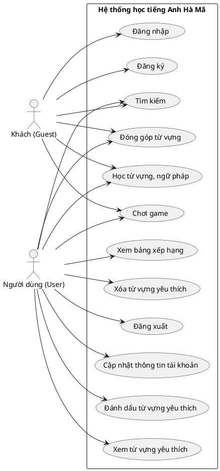

### 2.3. Đặc tả usecase

#### Đặc tả use case UC001 "Đăng nhập"
<table border="1" cellpadding="6" cellspacing="0" style="border-collapse: collapse; width: 100%;">
  <colgroup>
    <col style="width: 16%;">
    <col style="width: 34%;">
    <col style="width: 16%;">
    <col style="width: 34%;">
  </colgroup>
  <tr>
    <th colspan="4" style="background-color: #f2f2f2; text-align: center;">Đặc tả Use Case</th>
  </tr>
  <tr>
    <td><strong>Mã UseCase</strong></td>
    <td>UC001</td>
    <td><strong>Tên UseCase</strong></td>
    <td>Đăng nhập</td>
  </tr>
  <tr>
    <td><strong>Tác nhân</strong></td>
    <td colspan="3">Khách (Guest)</td>
  </tr>
  <tr>
    <td><strong>Tiền điều kiện</strong></td>
    <td colspan="3">Không</td>
  </tr>
  <tr>
    <td><strong>Luồng sự kiện chính</strong></td>
    <td colspan="3">
      <table border="1" cellpadding="4" cellspacing="0" style="border-collapse: collapse; width: 100%;">
        <colgroup>
          <col style="width: 10%;">
          <col style="width: 30%;">
          <col style="width: 60%;">
        </colgroup>
        <tr>
          <th>STT</th>
          <th>Thực hiện bởi</th>
          <th>Hành động</th>
        </tr>
        <tr>
          <td>1</td>
          <td>Khách</td>
          <td>Chọn chức năng Đăng nhập.</td>
        </tr>
        <tr>
          <td>2</td>
          <td>Hệ thống</td>
          <td>Hiển thị giao diện đăng nhập.</td>
        </tr>
        <tr>
          <td>3</td>
          <td>Khách</td>
          <td>Nhập email và mật khẩu (chi tiết ở phần dữ liệu đầu vào *).</td>
        </tr>
        <tr>
          <td>4</td>
          <td>Khách</td>
          <td>Yêu cầu đăng nhập.</td>
        </tr>
        <tr>
          <td>5</td>
          <td>Hệ thống</td>
          <td>Kiểm tra xem khách đã nhập đầy đủ các trường bắt buộc hay chưa.</td>
        </tr>
        <tr>
          <td>6</td>
          <td>Hệ thống</td>
          <td>Kiểm tra tính hợp lệ của email và mật khẩu.</td>
        </tr>
        <tr>
          <td>7</td>
          <td>Hệ thống</td>
          <td>Hiển thị giao diện trang chủ của người dùng.</td>
        </tr>
      </table>
    </td>
  </tr>
  <tr>
    <td><strong>Luồng sự kiện thay thế</strong></td>
    <td colspan="3">
      <table border="1" cellpadding="4" cellspacing="0" style="border-collapse: collapse; width: 100%;">
        <colgroup>
          <col style="width: 10%;">
          <col style="width: 30%;">
          <col style="width: 60%;">
        </colgroup>
        <tr>
          <th>STT</th>
          <th>Thực hiện bởi</th>
          <th>Hành động</th>
        </tr>
        <tr>
          <td>6a</td>
          <td>Hệ thống</td>
          <td>Thông báo lỗi: "Cần nhập các trường bắt buộc nhập" nếu khách nhập thiếu.</td>
        </tr>
        <tr>
          <td>7a</td>
          <td>Hệ thống</td>
          <td>Thông báo lỗi: "Email và/hoặc mật khẩu chưa đúng" nếu thông tin đăng nhập không khớp với hệ thống.</td>
        </tr>
      </table>
    </td>
  </tr>
  <tr>
    <td><strong>Hậu điều kiện</strong></td>
    <td colspan="3">Không</td>
  </tr>
</table>
<br/>

**Dữ liệu đầu vào:**
<table border="1" cellpadding="6" cellspacing="0" style="border-collapse: collapse; width: 100%;">
  <colgroup>
    <col style="width: 10%;">
    <col style="width: 25%;">
    <col style="width: 25%;">
    <col style="width: 15%;">
    <col style="width: 15%;">
    <col style="width: 10%;">
  </colgroup>
  <tr style="background-color: #f2f2f2;">
    <th>STT</th>
    <th>Trường dữ liệu</th>
    <th>Mô tả</th>
    <th>Bắt buộc</th>
    <th>Điều kiện hợp lệ</th>
    <th>Ví dụ</th>
  </tr>
  <tr>
    <td>1</td>
    <td>Email</td>
    <td>Địa chỉ email đăng nhập</td>
    <td>Có</td>
    <td>Định dạng email hợp lệ</td>
    <td>li@gmail.com</td>
  </tr>
  <tr>
    <td>2</td>
    <td>Mật khẩu</td>
    <td>Mật khẩu tài khoản</td>
    <td>Có</td>
    <td>Không</td>
    <td>123456</td>
  </tr>
</table>

***

#### Đặc tả use case UC002 "Đăng ký"
<table border="1" cellpadding="6" cellspacing="0" style="border-collapse: collapse; width: 100%;">
  <colgroup>
    <col style="width: 16%;">
    <col style="width: 34%;">
    <col style="width: 16%;">
    <col style="width: 34%;">
  </colgroup>
  <tr>
    <th colspan="4" style="background-color: #f2f2f2; text-align: center;">Đặc tả Use Case</th>
  </tr>
  <tr>
    <td><strong>Mã UseCase</strong></td>
    <td>UC002</td>
    <td><strong>Tên UseCase</strong></td>
    <td>Đăng ký</td>
  </tr>
  <tr>
    <td><strong>Tác nhân</strong></td>
    <td colspan="3">Khách (Guest)</td>
  </tr>
  <tr>
    <td><strong>Tiền điều kiện</strong></td>
    <td colspan="3">Không</td>
  </tr>
  <tr>
    <td><strong>Luồng sự kiện chính</strong></td>
    <td colspan="3">
      <table border="1" cellpadding="4" cellspacing="0" style="border-collapse: collapse; width: 100%;">
        <colgroup>
          <col style="width: 10%;">
          <col style="width: 30%;">
          <col style="width: 60%;">
        </colgroup>
        <tr>
          <th>STT</th>
          <th>Thực hiện bởi</th>
          <th>Hành động</th>
        </tr>
        <tr>
          <td>1</td>
          <td>Khách</td>
          <td>Chọn chức năng Đăng ký.</td>
        </tr>
        <tr>
          <td>2</td>
          <td>Hệ thống</td>
          <td>Hiển thị giao diện đăng ký.</td>
        </tr>
        <tr>
          <td>3</td>
          <td>Khách</td>
          <td>Nhập các thông tin: email, họ tên, và mật khẩu.</td>
        </tr>
        <tr>
          <td>4</td>
          <td>Khách</td>
          <td>Yêu cầu đăng ký.</td>
        </tr>
        <tr>
          <td>5</td>
          <td>Hệ thống</td>
          <td>Kiểm tra xem khách đã nhập đầy đủ các trường bắt buộc hay chưa.</td>
        </tr>
        <tr>
          <td>6</td>
          <td>Hệ thống</td>
          <td>Kiểm tra tính hợp lệ của định dạng email.</td>
        </tr>
        <tr>
          <td>7</td>
          <td>Hệ thống</td>
          <td>Kiểm tra xem email đăng ký đã tồn tại trong database hay chưa.</td>
        </tr>
        <tr>
          <td>8</td>
          <td>Hệ thống</td>
          <td>Lưu thông tin đăng ký vào database và hiển thị thông báo đăng ký thành công.</td>
        </tr>
        <tr>
          <td>9</td>
          <td>Hệ thống</td>
          <td>Hiển thị giao diện trang chủ cho người dùng.</td>
        </tr>
      </table>
    </td>
  </tr>
  <tr>
    <td><strong>Luồng sự kiện thay thế</strong></td>
    <td colspan="3">
      <table border="1" cellpadding="4" cellspacing="0" style="border-collapse: collapse; width: 100%;">
        <colgroup>
          <col style="width: 10%;">
          <col style="width: 30%;">
          <col style="width: 60%;">
        </colgroup>
        <tr>
          <th>STT</th>
          <th>Thực hiện bởi</th>
          <th>Hành động</th>
        </tr>
        <tr>
          <td>5a</td>
          <td>Hệ thống</td>
          <td>Thông báo lỗi: "Cần nhập các trường bắt buộc nhập" nếu khách nhập thiếu.</td>
        </tr>
        <tr>
          <td>6a</td>
          <td>Hệ thống</td>
          <td>Thông báo lỗi: "Email chưa hợp lệ" nếu định dạng email sai.</td>
        </tr>
        <tr>
          <td>7a</td>
          <td>Hệ thống</td>
          <td>Thông báo lỗi: "Email đã được sử dụng" nếu email đã có tài khoản liên kết.</td>
        </tr>
      </table>
    </td>
  </tr>
  <tr>
    <td><strong>Hậu điều kiện</strong></td>
    <td colspan="3">Không</td>
  </tr>
</table>
<br/>

**Dữ liệu đầu vào:**
<table border="1" cellpadding="6" cellspacing="0" style="border-collapse: collapse; width: 100%;">
  <colgroup>
    <col style="width: 10%;">
    <col style="width: 25%;">
    <col style="width: 25%;">
    <col style="width: 15%;">
    <col style="width: 15%;">
    <col style="width: 10%;">
  </colgroup>
  <tr style="background-color: #f2f2f2;">
    <th>STT</th>
    <th>Trường dữ liệu</th>
    <th>Mô tả</th>
    <th>Bắt buộc</th>
    <th>Điều kiện hợp lệ</th>
    <th>Ví dụ</th>
  </tr>
  <tr>
    <td>1</td>
    <td>Email</td>
    <td>Địa chỉ email đăng ký</td>
    <td>Có</td>
    <td>Định dạng email hợp lệ</td>
    <td>li@gmail.com</td>
  </tr>
  <tr>
    <td>2</td>
    <td>Tên</td>
    <td>Họ và tên của người dùng</td>
    <td>Có</td>
    <td>Không</td>
    <td>Li</td>
  </tr>
  <tr>
    <td>3</td>
    <td>Mật khẩu</td>
    <td>Mật khẩu tài khoản</td>
    <td>Có</td>
    <td>Không</td>
    <td>123456</td>
  </tr>
</table>

***

#### Đặc tả use case UC003 "Đăng xuất"
<table border="1" cellpadding="6" cellspacing="0" style="border-collapse: collapse; width: 100%;">
  <colgroup>
    <col style="width: 16%;">
    <col style="width: 34%;">
    <col style="width: 16%;">
    <col style="width: 34%;">
  </colgroup>
  <tr>
    <th colspan="4" style="background-color: #f2f2f2; text-align: center;">Đặc tả Use Case</th>
  </tr>
  <tr>
    <td><strong>Mã UseCase</strong></td>
    <td>UC003</td>
    <td><strong>Tên UseCase</strong></td>
    <td>Đăng xuất</td>
  </tr>
  <tr>
    <td><strong>Tác nhân</strong></td>
    <td colspan="3">Người dùng (User)</td>
  </tr>
  <tr>
    <td><strong>Tiền điều kiện</strong></td>
    <td colspan="3">Người dùng đang ở trạng thái đăng nhập.</td>
  </tr>
  <tr>
    <td><strong>Luồng sự kiện chính</strong></td>
    <td colspan="3">
      <table border="1" cellpadding="4" cellspacing="0" style="border-collapse: collapse; width: 100%;">
        <colgroup>
          <col style="width: 10%;">
          <col style="width: 30%;">
          <col style="width: 60%;">
        </colgroup>
        <tr>
          <th>STT</th>
          <th>Thực hiện bởi</th>
          <th>Hành động</th>
        </tr>
        <tr>
          <td>1</td>
          <td>Người dùng</td>
          <td>Chọn chức năng Đăng xuất.</td>
        </tr>
        <tr>
          <td>2</td>
          <td>Hệ thống</td>
          <td>Đăng xuất tài khoản hiện tại, hủy session và chuyển người dùng về giao diện trang chủ dành cho Khách.</td>
        </tr>
      </table>
    </td>
  </tr>
  <tr>
    <td><strong>Luồng sự kiện thay thế</strong></td>
    <td colspan="3">Không</td>
  </tr>
  <tr>
    <td><strong>Hậu điều kiện</strong></td>
    <td colspan="3">Tài khoản được đăng xuất an toàn.</td>
  </tr>
</table>

***

#### Đặc tả use case UC004 "Cập nhật thông tin tài khoản"
<table border="1" cellpadding="6" cellspacing="0" style="border-collapse: collapse; width: 100%;">
  <colgroup>
    <col style="width: 16%;">
    <col style="width: 34%;">
    <col style="width: 16%;">
    <col style="width: 34%;">
  </colgroup>
  <tr>
    <th colspan="4" style="background-color: #f2f2f2; text-align: center;">Đặc tả Use Case</th>
  </tr>
  <tr>
    <td><strong>Mã UseCase</strong></td>
    <td>UC004</td>
    <td><strong>Tên UseCase</strong></td>
    <td>Cập nhật thông tin tài khoản</td>
  </tr>
  <tr>
    <td><strong>Tác nhân</strong></td>
    <td colspan="3">Người dùng (User)</td>
  </tr>
  <tr>
    <td><strong>Tiền điều kiện</strong></td>
    <td colspan="3">Đã đăng nhập thành công.</td>
  </tr>
  <tr>
    <td><strong>Luồng sự kiện chính</strong></td>
    <td colspan="3">
      <table border="1" cellpadding="4" cellspacing="0" style="border-collapse: collapse; width: 100%;">
        <colgroup>
          <col style="width: 10%;">
          <col style="width: 30%;">
          <col style="width: 60%;">
        </colgroup>
        <tr>
          <th>STT</th>
          <th>Thực hiện bởi</th>
          <th>Hành động</th>
        </tr>
        <tr>
          <td>1</td>
          <td>Người dùng</td>
          <td>Chọn chức năng Cập nhật thông tin tài khoản.</td>
        </tr>
        <tr>
          <td>2</td>
          <td>Hệ thống</td>
          <td>Hiển thị giao diện thông tin tài khoản hiện tại.</td>
        </tr>
        <tr>
          <td>3</td>
          <td>Người dùng</td>
          <td>Chỉnh sửa các trường thông tin (tên, username).</td>
        </tr>
        <tr>
          <td>4</td>
          <td>Người dùng</td>
          <td>Yêu cầu cập nhật thông tin.</td>
        </tr>
        <tr>
          <td>5</td>
          <td>Hệ thống</td>
          <td>Kiểm tra tính hợp lệ của username mới (không chứa khoảng trống).</td>
        </tr>
        <tr>
          <td>6</td>
          <td>Hệ thống</td>
          <td>Cập nhật thông tin mới vào database và hiển thị thông báo thành công.</td>
        </tr>
      </table>
    </td>
  </tr>
  <tr>
    <td><strong>Luồng sự kiện thay thế</strong></td>
    <td colspan="3">
      <table border="1" cellpadding="4" cellspacing="0" style="border-collapse: collapse; width: 100%;">
        <colgroup>
          <col style="width: 10%;">
          <col style="width: 30%;">
          <col style="width: 60%;">
        </colgroup>
        <tr>
          <th>STT</th>
          <th>Thực hiện bởi</th>
          <th>Hành động</th>
        </tr>
        <tr>
          <td>5a</td>
          <td>Hệ thống</td>
          <td>Thông báo lỗi: "Nhập lại username nếu không hợp lệ (username không chứa khoảng trống)" nếu có lỗi định dạng.</td>
        </tr>
      </table>
    </td>
  </tr>
  <tr>
    <td><strong>Hậu điều kiện</strong></td>
    <td colspan="3">Thông tin mới được cập nhật thành công.</td>
  </tr>
</table>
<br/>

**Dữ liệu đầu vào:**
<table border="1" cellpadding="6" cellspacing="0" style="border-collapse: collapse; width: 100%;">
  <colgroup>
    <col style="width: 10%;">
    <col style="width: 25%;">
    <col style="width: 25%;">
    <col style="width: 15%;">
    <col style="width: 15%;">
    <col style="width: 10%;">
  </colgroup>
  <tr style="background-color: #f2f2f2;">
    <th>STT</th>
    <th>Trường dữ liệu</th>
    <th>Mô tả</th>
    <th>Bắt buộc</th>
    <th>Điều kiện hợp lệ</th>
    <th>Ví dụ</th>
  </tr>
  <tr>
    <td>1</td>
    <td>Tên</td>
    <td>Họ và tên của người dùng</td>
    <td>Không</td>
    <td>Không</td>
    <td>Li</td>
  </tr>
  <tr>
    <td>2</td>
    <td>Username</td>
    <td>Tên tài khoản định danh</td>
    <td>Không</td>
    <td>Không chứa khoảng trống, kí tự đặc biệt và dấu câu</td>
    <td>camli123</td>
  </tr>
</table>

***

#### Đặc tả use case UC005 "Tìm kiếm"
<table border="1" cellpadding="6" cellspacing="0" style="border-collapse: collapse; width: 100%;">
  <colgroup>
    <col style="width: 16%;">
    <col style="width: 34%;">
    <col style="width: 16%;">
    <col style="width: 34%;">
  </colgroup>
  <tr>
    <th colspan="4" style="background-color: #f2f2f2; text-align: center;">Đặc tả Use Case</th>
  </tr>
  <tr>
    <td><strong>Mã UseCase</strong></td>
    <td>UC005</td>
    <td><strong>Tên UseCase</strong></td>
    <td>Tìm kiếm</td>
  </tr>
  <tr>
    <td><strong>Tác nhân</strong></td>
    <td colspan="3">Khách, Người dùng</td>
  </tr>
  <tr>
    <td><strong>Tiền điều kiện</strong></td>
    <td colspan="3">Không</td>
  </tr>
  <tr>
    <td><strong>Luồng sự kiện chính</strong></td>
    <td colspan="3">
      <table border="1" cellpadding="4" cellspacing="0" style="border-collapse: collapse; width: 100%;">
        <colgroup>
          <col style="width: 10%;">
          <col style="width: 30%;">
          <col style="width: 60%;">
        </colgroup>
        <tr>
          <th>STT</th>
          <th>Thực hiện bởi</th>
          <th>Hành động</th>
        </tr>
        <tr>
          <td>1</td>
          <td>Tác nhân</td>
          <td>Nhập từ khóa và chọn chức năng Tìm kiếm trên trang chủ.</td>
        </tr>
        <tr>
          <td>2</td>
          <td>Hệ thống</td>
          <td>Tìm kiếm trong CSDL và hiển thị danh sách từ vựng/ngữ pháp khớp kết quả.</td>
        </tr>
      </table>
    </td>
  </tr>
  <tr>
    <td><strong>Luồng sự kiện thay thế</strong></td>
    <td colspan="3">
      <table border="1" cellpadding="4" cellspacing="0" style="border-collapse: collapse; width: 100%;">
        <colgroup>
          <col style="width: 10%;">
          <col style="width: 30%;">
          <col style="width: 60%;">
        </colgroup>
        <tr>
          <th>STT</th>
          <th>Thực hiện bởi</th>
          <th>Hành động</th>
        </tr>
        <tr>
          <td>2a</td>
          <td>Hệ thống</td>
          <td>Thông báo: "Không tìm thấy kết quả nào cả" nếu không có dữ liệu trùng khớp.</td>
        </tr>
      </table>
    </td>
  </tr>
  <tr>
    <td><strong>Hậu điều kiện</strong></td>
    <td colspan="3">Không</td>
  </tr>
</table>

***

#### Đặc tả use case UC006 "Xem từ vựng yêu thích"
<table border="1" cellpadding="6" cellspacing="0" style="border-collapse: collapse; width: 100%;">
  <colgroup>
    <col style="width: 16%;">
    <col style="width: 34%;">
    <col style="width: 16%;">
    <col style="width: 34%;">
  </colgroup>
  <tr>
    <th colspan="4" style="background-color: #f2f2f2; text-align: center;">Đặc tả Use Case</th>
  </tr>
  <tr>
    <td><strong>Mã UseCase</strong></td>
    <td>UC006</td>
    <td><strong>Tên UseCase</strong></td>
    <td>Xem từ vựng yêu thích</td>
  </tr>
  <tr>
    <td><strong>Tác nhân</strong></td>
    <td colspan="3">Người dùng (User)</td>
  </tr>
  <tr>
    <td><strong>Tiền điều kiện</strong></td>
    <td colspan="3">Đã đăng nhập thành công.</td>
  </tr>
  <tr>
    <td><strong>Luồng sự kiện chính</strong></td>
    <td colspan="3">
      <table border="1" cellpadding="4" cellspacing="0" style="border-collapse: collapse; width: 100%;">
        <colgroup>
          <col style="width: 10%;">
          <col style="width: 30%;">
          <col style="width: 60%;">
        </colgroup>
        <tr>
          <th>STT</th>
          <th>Thực hiện bởi</th>
          <th>Hành động</th>
        </tr>
        <tr>
          <td>1</td>
          <td>Người dùng</td>
          <td>Chọn chức năng Xem từ vựng yêu thích.</td>
        </tr>
        <tr>
          <td>2</td>
          <td>Hệ thống</td>
          <td>Truy xuất danh sách từ vựng mà người dùng đã thả tim và hiển thị lên màn hình.</td>
        </tr>
      </table>
    </td>
  </tr>
  <tr>
    <td><strong>Luồng sự kiện thay thế</strong></td>
    <td colspan="3">Không</td>
  </tr>
  <tr>
    <td><strong>Hậu điều kiện</strong></td>
    <td colspan="3">Không</td>
  </tr>
</table>

***

#### Đặc tả use case UC007 "Xem bảng xếp hạng"
<table border="1" cellpadding="6" cellspacing="0" style="border-collapse: collapse; width: 100%;">
  <colgroup>
    <col style="width: 16%;">
    <col style="width: 34%;">
    <col style="width: 16%;">
    <col style="width: 34%;">
  </colgroup>
  <tr>
    <th colspan="4" style="background-color: #f2f2f2; text-align: center;">Đặc tả Use Case</th>
  </tr>
  <tr>
    <td><strong>Mã UseCase</strong></td>
    <td>UC007</td>
    <td><strong>Tên UseCase</strong></td>
    <td>Xem bảng xếp hạng</td>
  </tr>
  <tr>
    <td><strong>Tác nhân</strong></td>
    <td colspan="3">Người dùng (User)</td>
  </tr>
  <tr>
    <td><strong>Tiền điều kiện</strong></td>
    <td colspan="3">Đã đăng nhập thành công.</td>
  </tr>
  <tr>
    <td><strong>Luồng sự kiện chính</strong></td>
    <td colspan="3">
      <table border="1" cellpadding="4" cellspacing="0" style="border-collapse: collapse; width: 100%;">
        <colgroup>
          <col style="width: 10%;">
          <col style="width: 30%;">
          <col style="width: 60%;">
        </colgroup>
        <tr>
          <th>STT</th>
          <th>Thực hiện bởi</th>
          <th>Hành động</th>
        </tr>
        <tr>
          <td>1</td>
          <td>Người dùng</td>
          <td>Chọn chức năng Xem bảng xếp hạng.</td>
        </tr>
        <tr>
          <td>2</td>
          <td>Hệ thống</td>
          <td>Tổng hợp điểm số của tất cả người dùng và hiển thị danh sách xếp hạng.</td>
        </tr>
      </table>
    </td>
  </tr>
  <tr>
    <td><strong>Luồng sự kiện thay thế</strong></td>
    <td colspan="3">Không</td>
  </tr>
  <tr>
    <td><strong>Hậu điều kiện</strong></td>
    <td colspan="3">Không</td>
  </tr>
</table>

***

#### Đặc tả use case UC008 "Đóng góp từ vựng"
<table border="1" cellpadding="6" cellspacing="0" style="border-collapse: collapse; width: 100%;">
  <colgroup>
    <col style="width: 16%;">
    <col style="width: 34%;">
    <col style="width: 16%;">
    <col style="width: 34%;">
  </colgroup>
  <tr>
    <th colspan="4" style="background-color: #f2f2f2; text-align: center;">Đặc tả Use Case</th>
  </tr>
  <tr>
    <td><strong>Mã UseCase</strong></td>
    <td>UC008</td>
    <td><strong>Tên UseCase</strong></td>
    <td>Đóng góp từ vựng</td>
  </tr>
  <tr>
    <td><strong>Tác nhân</strong></td>
    <td colspan="3">Khách, Người dùng</td>
  </tr>
  <tr>
    <td><strong>Tiền điều kiện</strong></td>
    <td colspan="3">Không</td>
  </tr>
  <tr>
    <td><strong>Luồng sự kiện chính</strong></td>
    <td colspan="3">
      <table border="1" cellpadding="4" cellspacing="0" style="border-collapse: collapse; width: 100%;">
        <colgroup>
          <col style="width: 10%;">
          <col style="width: 30%;">
          <col style="width: 60%;">
        </colgroup>
        <tr>
          <th>STT</th>
          <th>Thực hiện bởi</th>
          <th>Hành động</th>
        </tr>
        <tr>
          <td>1</td>
          <td>Tác nhân</td>
          <td>Chọn chức năng Đóng góp từ vựng trên giao diện.</td>
        </tr>
        <tr>
          <td>2</td>
          <td>Hệ thống</td>
          <td>Hiển thị giao diện Đóng góp từ vựng.</td>
        </tr>
        <tr>
          <td>3</td>
          <td>Tác nhân</td>
          <td>Nhập các thông tin yêu cầu của từ đóng góp (từ, nghĩa, ví dụ...).</td>
        </tr>
        <tr>
          <td>4</td>
          <td>Tác nhân</td>
          <td>Yêu cầu thêm từ.</td>
        </tr>
        <tr>
          <td>5</td>
          <td>Hệ thống</td>
          <td>Kiểm tra xem tác nhân đã nhập các trường bắt buộc hay chưa.</td>
        </tr>
        <tr>
          <td>6</td>
          <td>Hệ thống</td>
          <td>Kiểm tra từ được đóng góp đã tồn tại trong database chưa.</td>
        </tr>
        <tr>
          <td>7</td>
          <td>Hệ thống</td>
          <td>Thêm từ vựng mới vào database và hiển thị thông báo thành công.</td>
        </tr>
      </table>
    </td>
  </tr>
  <tr>
    <td><strong>Luồng sự kiện thay thế</strong></td>
    <td colspan="3">
      <table border="1" cellpadding="4" cellspacing="0" style="border-collapse: collapse; width: 100%;">
        <colgroup>
          <col style="width: 10%;">
          <col style="width: 30%;">
          <col style="width: 60%;">
        </colgroup>
        <tr>
          <th>STT</th>
          <th>Thực hiện bởi</th>
          <th>Hành động</th>
        </tr>
        <tr>
          <td>5a</td>
          <td>Hệ thống</td>
          <td>Thông báo lỗi: "Cần nhập các trường bắt buộc" nếu nhập thiếu.</td>
        </tr>
        <tr>
          <td>7a</td>
          <td>Hệ thống</td>
          <td>Thông báo lỗi: "Từ này đã tồn tại trong hệ thống" nếu trùng từ vựng.</td>
        </tr>
      </table>
    </td>
  </tr>
  <tr>
    <td><strong>Hậu điều kiện</strong></td>
    <td colspan="3">Không</td>
  </tr>
</table>

***

#### Đặc tả use case UC009 "Học từ vựng, ngữ pháp"
<table border="1" cellpadding="6" cellspacing="0" style="border-collapse: collapse; width: 100%;">
  <colgroup>
    <col style="width: 16%;">
    <col style="width: 34%;">
    <col style="width: 16%;">
    <col style="width: 34%;">
  </colgroup>
  <tr>
    <th colspan="4" style="background-color: #f2f2f2; text-align: center;">Đặc tả Use Case</th>
  </tr>
  <tr>
    <td><strong>Mã UseCase</strong></td>
    <td>UC009</td>
    <td><strong>Tên UseCase</strong></td>
    <td>Học từ vựng, ngữ pháp</td>
  </tr>
  <tr>
    <td><strong>Tác nhân</strong></td>
    <td colspan="3">Khách, Người dùng</td>
  </tr>
  <tr>
    <td><strong>Tiền điều kiện</strong></td>
    <td colspan="3">Không</td>
  </tr>
  <tr>
    <td><strong>Luồng sự kiện chính</strong></td>
    <td colspan="3">
      <table border="1" cellpadding="4" cellspacing="0" style="border-collapse: collapse; width: 100%;">
        <colgroup>
          <col style="width: 10%;">
          <col style="width: 30%;">
          <col style="width: 60%;">
        </colgroup>
        <tr>
          <th>STT</th>
          <th>Thực hiện bởi</th>
          <th>Hành động</th>
        </tr>
        <tr>
          <td>1</td>
          <td>Tác nhân</td>
          <td>Chọn chức năng Học từ vựng, ngữ pháp.</td>
        </tr>
        <tr>
          <td>2</td>
          <td>Hệ thống</td>
          <td>Hiển thị giao diện tương ứng với các danh mục bài học (IPA, Flashcard, Grammar...).</td>
        </tr>
      </table>
    </td>
  </tr>
  <tr>
    <td><strong>Luồng sự kiện thay thế</strong></td>
    <td colspan="3">Không</td>
  </tr>
  <tr>
    <td><strong>Hậu điều kiện</strong></td>
    <td colspan="3">Không</td>
  </tr>
</table>

***

#### Đặc tả use case UC010 "Đánh dấu từ vựng yêu thích"
<table border="1" cellpadding="6" cellspacing="0" style="border-collapse: collapse; width: 100%;">
  <colgroup>
    <col style="width: 16%;">
    <col style="width: 34%;">
    <col style="width: 16%;">
    <col style="width: 34%;">
  </colgroup>
  <tr>
    <th colspan="4" style="background-color: #f2f2f2; text-align: center;">Đặc tả Use Case</th>
  </tr>
  <tr>
    <td><strong>Mã UseCase</strong></td>
    <td>UC010</td>
    <td><strong>Tên UseCase</strong></td>
    <td>Đánh dấu từ vựng yêu thích</td>
  </tr>
  <tr>
    <td><strong>Tác nhân</strong></td>
    <td colspan="3">Người dùng (User)</td>
  </tr>
  <tr>
    <td><strong>Tiền điều kiện</strong></td>
    <td colspan="3">Đã đăng nhập thành công.</td>
  </tr>
  <tr>
    <td><strong>Luồng sự kiện chính</strong></td>
    <td colspan="3">
      <table border="1" cellpadding="4" cellspacing="0" style="border-collapse: collapse; width: 100%;">
        <colgroup>
          <col style="width: 10%;">
          <col style="width: 30%;">
          <col style="width: 60%;">
        </colgroup>
        <tr>
          <th>STT</th>
          <th>Thực hiện bởi</th>
          <th>Hành động</th>
        </tr>
        <tr>
          <td>1</td>
          <td>Người dùng</td>
          <td>Nhấn vào biểu tượng trái tim bên cạnh từ vựng khi đang học.</td>
        </tr>
        <tr>
          <td>2</td>
          <td>Hệ thống</td>
          <td>Xác nhận yêu cầu của người dùng.</td>
        </tr>
        <tr>
          <td>3</td>
          <td>Hệ thống</td>
          <td>Lưu thông tin từ vựng yêu thích vào danh sách yêu thích của người dùng trong database.</td>
        </tr>
      </table>
    </td>
  </tr>
  <tr>
    <td><strong>Luồng sự kiện thay thế</strong></td>
    <td colspan="3">Không</td>
  </tr>
  <tr>
    <td><strong>Hậu điều kiện</strong></td>
    <td colspan="3">Từ vựng được thêm vào danh sách yêu thích.</td>
  </tr>
</table>

***

#### Đặc tả use case UC011 "Xóa từ vựng yêu thích"
<table border="1" cellpadding="6" cellspacing="0" style="border-collapse: collapse; width: 100%;">
  <colgroup>
    <col style="width: 16%;">
    <col style="width: 34%;">
    <col style="width: 16%;">
    <col style="width: 34%;">
  </colgroup>
  <tr>
    <th colspan="4" style="background-color: #f2f2f2; text-align: center;">Đặc tả Use Case</th>
  </tr>
  <tr>
    <td><strong>Mã UseCase</strong></td>
    <td>UC011</td>
    <td><strong>Tên UseCase</strong></td>
    <td>Xóa từ vựng yêu thích</td>
  </tr>
  <tr>
    <td><strong>Tác nhân</strong></td>
    <td colspan="3">Người dùng (User)</td>
  </tr>
  <tr>
    <td><strong>Tiền điều kiện</strong></td>
    <td colspan="3">Đã đăng nhập thành công và đã có từ vựng trong danh sách yêu thích.</td>
  </tr>
  <tr>
    <td><strong>Luồng sự kiện chính</strong></td>
    <td colspan="3">
      <table border="1" cellpadding="4" cellspacing="0" style="border-collapse: collapse; width: 100%;">
        <colgroup>
          <col style="width: 10%;">
          <col style="width: 30%;">
          <col style="width: 60%;">
        </colgroup>
        <tr>
          <th>STT</th>
          <th>Thực hiện bởi</th>
          <th>Hành động</th>
        </tr>
        <tr>
          <td>1</td>
          <td>Người dùng</td>
          <td>Bỏ chọn hình trái tim hoặc nhấn nút "Xóa" tại trang danh sách yêu thích.</td>
        </tr>
        <tr>
          <td>2</td>
          <td>Hệ thống</td>
          <td>Xác nhận yêu cầu của người dùng.</td>
        </tr>
        <tr>
          <td>3</td>
          <td>Hệ thống</td>
          <td>Xóa từ vựng tương ứng khỏi danh sách yêu thích của người dùng trong database.</td>
        </tr>
      </table>
    </td>
  </tr>
  <tr>
    <td><strong>Luồng sự kiện thay thế</strong></td>
    <td colspan="3">Không</td>
  </tr>
  <tr>
    <td><strong>Hậu điều kiện</strong></td>
    <td colspan="3">Từ vựng bị loại khỏi danh sách yêu thích.</td>
  </tr>
</table>

***

#### Đặc tả use case UC012 "Chơi game"
<table border="1" cellpadding="6" cellspacing="0" style="border-collapse: collapse; width: 100%;">
  <colgroup>
    <col style="width: 16%;">
    <col style="width: 34%;">
    <col style="width: 16%;">
    <col style="width: 34%;">
  </colgroup>
  <tr>
    <th colspan="4" style="background-color: #f2f2f2; text-align: center;">Đặc tả Use Case</th>
  </tr>
  <tr>
    <td><strong>Mã UseCase</strong></td>
    <td>UC012</td>
    <td><strong>Tên UseCase</strong></td>
    <td>Chơi game</td>
  </tr>
  <tr>
    <td><strong>Tác nhân</strong></td>
    <td colspan="3">Khách, Người dùng</td>
  </tr>
  <tr>
    <td><strong>Tiền điều kiện</strong></td>
    <td colspan="3">Không</td>
  </tr>
  <tr>
    <td><strong>Luồng sự kiện chính</strong></td>
    <td colspan="3">
      <table border="1" cellpadding="4" cellspacing="0" style="border-collapse: collapse; width: 100%;">
        <colgroup>
          <col style="width: 10%;">
          <col style="width: 30%;">
          <col style="width: 60%;">
        </colgroup>
        <tr>
          <th>STT</th>
          <th>Thực hiện bởi</th>
          <th>Hành động</th>
        </tr>
        <tr>
          <td>1</td>
          <td>Tác nhân</td>
          <td>Chọn chơi game và chọn 1 trong 3 danh mục trò chơi: *Hãy chọn từ đúng*, *Ghép từ*, *Tay nhanh hơn não*.</td>
        </tr>
        <tr>
          <td>2</td>
          <td>Hệ thống</td>
          <td>Xác nhận yêu cầu và điều hướng người dùng đến giao diện game tương ứng.</td>
        </tr>
        <tr>
          <td>3</td>
          <td>Hệ thống</td>
          <td>Hiển thị dữ liệu trò chơi (câu hỏi, hình ảnh, từ vựng...) tương ứng với lựa chọn.</td>
        </tr>
      </table>
    </td>
  </tr>
  <tr>
    <td><strong>Luồng sự kiện thay thế</strong></td>
    <td colspan="3">Không</td>
  </tr>
  <tr>
    <td><strong>Hậu điều kiện</strong></td>
    <td colspan="3">Không</td>
  </tr>
</table>

***

### 2.4. Biểu đồ hoạt động

#### Usecase "Đăng nhập"
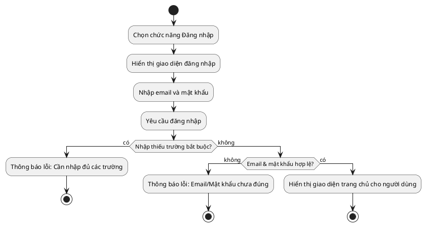

#### Usecase "Đăng ký"
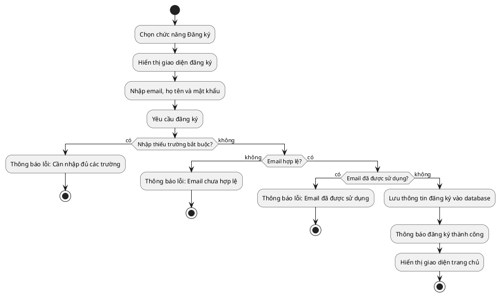

#### Usecase "Đăng xuất"
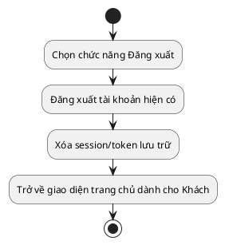

#### Usecase "Cập nhật thông tin tài khoản"
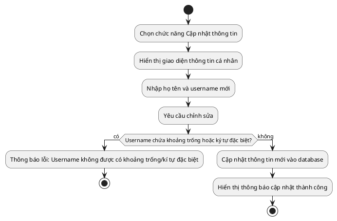

#### Usecase "Tìm kiếm"
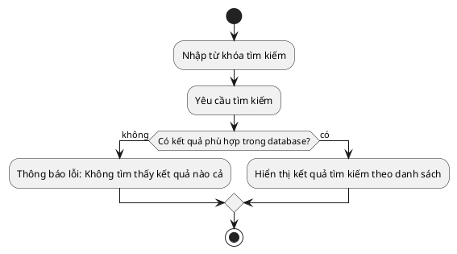

#### Usecase "Xem từ vựng yêu thích"
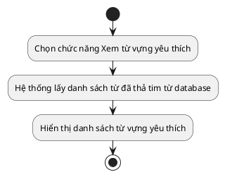

#### Usecase "Xem bảng xếp hạng"
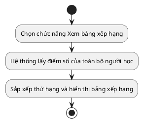

#### Usecase "Thêm từ vựng yêu thích"
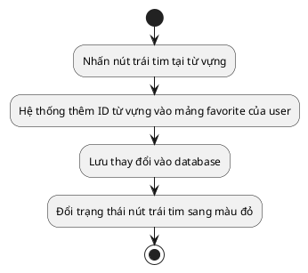

#### Usecase "Xóa từ vựng yêu thích"
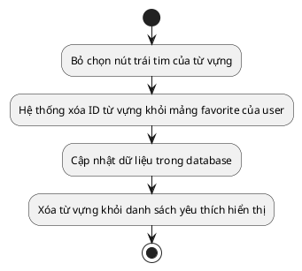

#### Usecase "Đóng góp từ vựng"
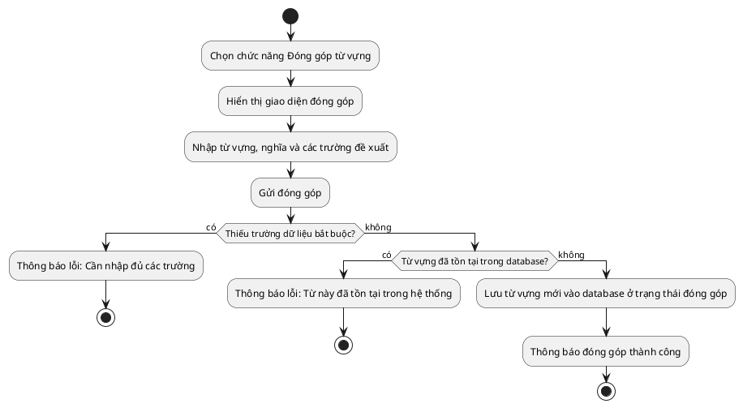

#### Usecase "Chơi game"
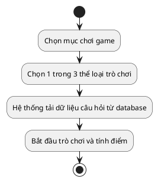

#### Usecase "Học từ vựng, ngữ pháp"
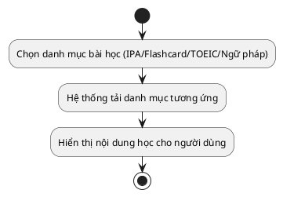

***

### 2.5. Các yêu cầu phi chức năng

#### Chức năng & Độ tin cậy
- Hỗ trợ nhiều người dùng truy cập và học đồng thời.
- Nếu xảy ra lỗi hệ thống, khả năng tự khôi phục lại bình thường trong vòng 1 giờ.

#### Tính dễ dùng
- Giao diện người dùng thân thiện, trực quan, hỗ trợ Responsive (tương thích trên nhiều kích thước màn hình khác nhau như desktop, tablet, mobile).

#### Tính ổn định
- Hệ thống hoạt động liên tục 24/7, với thời gian uptime cam kết trên 90%.

#### Hiệu suất
- Hệ thống chịu tải tốt, hỗ trợ lên đến 1000 người dùng truy xuất đồng thời vào cơ sở dữ liệu trung tâm.
- Tốc độ phản hồi và truy xuất dữ liệu danh mục học tập không quá 10 giây.

#### Ràng buộc thiết kế
- Ứng dụng phải được thiết kế và triển khai dựa trên nền tảng Web App.

***

## CHƯƠNG 3. PHÂN TÍCH YÊU CẦU

### 3.1. Xác định các lớp phân tích

Để thực hiện các chức năng trên, hệ thống được cấu trúc dựa trên các lớp phân tích chính:
- **Lớp Boundary (Giao diện):** Biên nhận yêu cầu người dùng và phản hồi giao diện (`LoginForm`, `RegisterForm`, `Header`, `HomeView`, `LearnView`, `GameView`, `RankingView`, `FavoriteView`, `ContributionForm`).
- **Lớp Control (Điều khiển):** Xử lý logic nghiệp vụ và định tuyến luồng (`AuthController`, `VocabularyController`, `GrammarController`, `GameController`, `RankingController`, `UserController`).
- **Lớp Entity (Dữ liệu):** Lưu trữ thông tin và tương tác database (`User`, `Vocabulary`, `Grammar`, `GameRecord`, `Contribution`).

#### Lớp phân tích theo từng Usecase
- **Usecase "Đăng nhập":** `LoginForm` (Boundary) -> `AuthController` (Control) -> `User` (Entity).
- **Usecase "Đăng ký":** `RegisterForm` (Boundary) -> `AuthController` (Control) -> `User` (Entity).
- **Usecase "Cập nhật thông tin tài khoản":** `ProfileForm` (Boundary) -> `UserController` (Control) -> `User` (Entity).
- **Usecase "Tìm kiếm":** `SearchBar` (Boundary) -> `VocabularyController` (Control) -> `Vocabulary` / `Grammar` (Entity).
- **Usecase "Thao tác các tính năng học/chơi":** `LearnView`/`GameView` (Boundary) -> `VocabularyController`/`GameController` (Control) -> `Vocabulary`/`GameRecord` (Entity).

### 3.2. Biểu đồ trình tự (Sequence Diagrams)

#### Usecase "Đăng nhập"
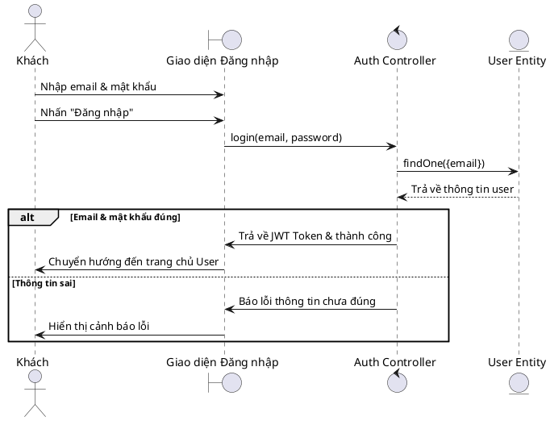

#### Usecase "Đăng ký"
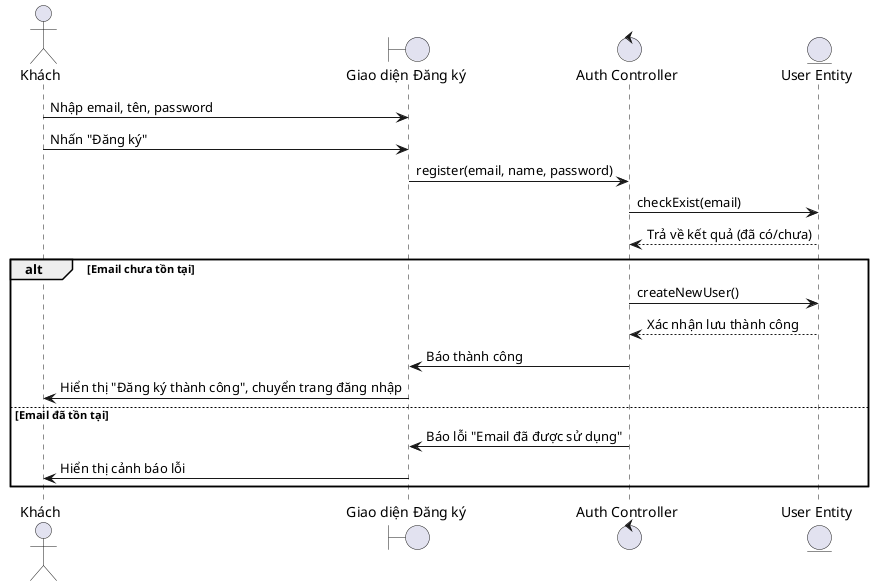

#### Usecase "Đăng xuất"
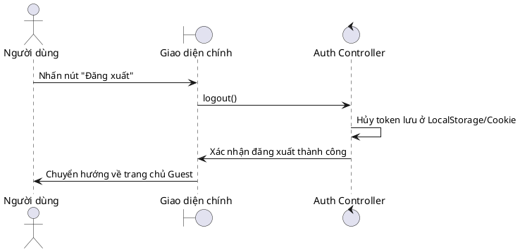

#### Usecase "Cập nhật thông tin tài khoản"
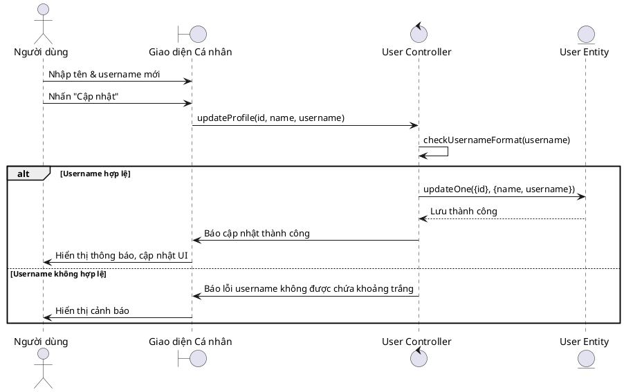

#### Usecase "Tìm kiếm"
```plantuml
@startuml
actor Tác nhân as Actor
boundary "Thanh tìm kiếm" as SearchUI
control "Vocabulary Controller" as VocabCtrl
entity "Vocabulary Entity" as VocabEnt

Actor -> SearchUI : Nhập từ khóa
SearchUI -> VocabCtrl : search(keyword)
VocabCtrl -> VocabEnt : find({word: keyword})
VocabEnt --> VocabCtrl : Trả về danh sách kết quả
alt Tìm thấy kết quả
  VocabCtrl -> SearchUI : Trả về danh sách từ vựng
  SearchUI -> Actor : Hiển thị danh sách kết quả tìm kiếm
else Không tìm thấy
  VocabCtrl -> SearchUI : Trả về mảng rỗng
  SearchUI -> Actor : Hiển thị thông báo "Không tìm thấy kết quả"
end
@enduml
```

### 3.3. Biểu đồ lớp (Class Diagram)

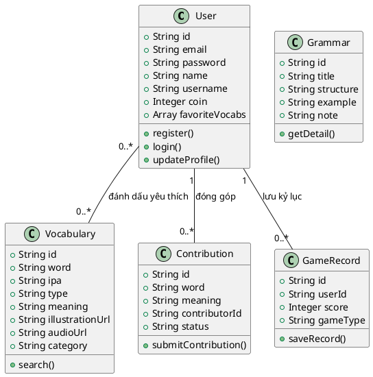

***

## CHƯƠNG 4. THIẾT KẾ CHƯƠNG TRÌNH

### 4.1. Thiết kế kiến trúc

Hệ thống được phát triển theo kiến trúc **MVC (Model - View - Controller)**, phân tách giao diện và xử lý nghiệp vụ:
- **View:** Giao diện ReactJS tương tác với người dùng, nhận các sự kiện click, nhập form và truyền gửi dữ liệu dạng RESTful API cho Controller.
- **Controller (Backend NodeJS/ExpressJS):** Chịu trách nhiệm tiếp nhận request API từ View, xử lý logic nghiệp vụ, thực hiện xác thực (JWT), gọi các phương thức tương tác CSDL từ Model và trả kết quả định dạng JSON về cho View.
- **Model:** Định nghĩa schema dữ liệu thông qua Mongoose, tương tác trực tiếp với cơ sở dữ liệu MongoDB Atlas để truy xuất, thêm, sửa hoặc xóa dữ liệu.

*Sự tách biệt rõ ràng này giúp mã nguồn dễ bảo trì, dễ mở rộng và tăng tính bảo mật cho hệ thống.*

### 4.2. Thiết kế cơ sở dữ liệu

Hệ thống sử dụng cơ sở dữ liệu NoSQL MongoDB với các collection chính như sau:
1. **users:** Lưu thông tin tài khoản (email, password băm bằng bcrypt, name, username, coin tích lũy, danh sách ID từ vựng yêu thích).
2. **vocabularies:** Lưu thông tin từ vựng (word, phiên âm IPA, loại từ, nghĩa tiếng Việt, URL ảnh minh họa, URL file âm thanh phát âm, chủ đề như TOEIC/giao tiếp).
3. **grammars:** Lưu thông tin ngữ pháp (tên ngữ pháp, cấu trúc tổng quát, ví dụ minh họa và các lưu ý sử dụng).
4. **contributions:** Lưu danh sách từ vựng được đóng góp từ người dùng và trạng thái kiểm duyệt.
5. **gamerecords:** Lưu lịch sử chơi game của người dùng để tính toán điểm số xếp hạng.

***

## CHƯƠNG 5. XÂY DỰNG CHƯƠNG TRÌNH MINH HỌA

### 5.1. Công nghệ sử dụng

#### Backend & Database
- **NodeJS & ExpressJS:** Nền tảng xây dựng Web Server và thiết lập RESTful APIs.
- **MongoDB & Mongoose:** Hệ quản trị CSDL NoSQL và thư viện ánh xạ đối tượng (ODM).
- **JWT (JSON Web Token):** Xác thực tài khoản người dùng và bảo mật API.
- **Nodemailer:** Gửi email xác nhận đóng góp hoặc đặt lại mật khẩu.
- **PassportJS:** Hỗ trợ mở rộng đăng nhập bằng tài khoản Google, Facebook.

#### Frontend
- **ReactJS:** Thư viện xây dựng giao diện người dùng theo component.
- **Redux Toolkit:** Quản lý state toàn cục cho ứng dụng (thông tin đăng nhập, điểm số, trạng thái giao diện).
- **Material UI (MUI):** Thư viện components thiết kế giao diện hiện đại, chuyên nghiệp.
- **Axios:** Thực hiện gửi nhận yêu cầu HTTP tới API Server.
- **React Hook Form & Yup:** Quản lý form và kiểm tra tính hợp lệ của dữ liệu nhập (validation).

#### Storage & Cloud Services
- **Cloudinary:** Lưu trữ hình ảnh minh họa và file âm thanh phát âm.
- **MongoDB Atlas:** Dịch vụ lưu trữ cơ sở dữ liệu MongoDB trên đám mây.
- **Heroku / Vercel:** Môi trường deploy ứng dụng phục vụ demo trực tuyến.

### 5.2. Cấu trúc thư mục

```
itss-english/
├── backend/
│   ├── config/          # Cấu hình db, passport, cloudinary
│   ├── controllers/     # Xử lý logic nghiệp vụ API
│   ├── models/          # Khai báo schema Mongoose
│   ├── routes/          # Định tuyến API endpoint
│   ├── middleware/      # Middleware xác thực JWT, phân quyền
│   └── server.js        # Entry point của backend
└── frontend/
    ├── public/
    └── src/
        ├── assets/      # Hình ảnh, icon tĩnh
        ├── components/  # Component tái sử dụng (Button, Card, NavBar...)
        ├── features/    # Quản lý state theo module (authSlice, vocabSlice...)
        ├── pages/       # Các trang chính (Home, Login, Learn, Game, Profile...)
        ├── services/    # Thiết lập Axios API calls
        └── App.js       # Component gốc định nghĩa Router
```

### 5.3. Sơ đồ dịch chuyển màn hình
```
[Trang chủ Guest]
   │
   ├─── Đăng nhập / Đăng ký ───► [Trang chủ User]
   │                                  │
   ├─── Học IPA ──────────────────────┼───► Đánh dấu / Xem từ yêu thích
   │                                  ├───► Học mẫu câu giao tiếp
   ├─── Tra từ điển ──────────────────┼───► Luyện Flashcard (Gallery/Slide)
   │                                  ├───► Học từ vựng TOEIC
   ├─── Học ngữ pháp ─────────────────┼───► Đóng góp từ vựng mới
   │                                  ├───► Chơi Game (3 thể loại)
   └─── Chơi game (Guest)             └───► Xem bảng xếp hạng & Profile
```

### 5.4. Giao diện minh họa

Ứng dụng hỗ trợ hai chế độ hiển thị: **Giao diện sáng (Light Mode)** và **Giao diện tối (Dark Mode)** giúp bảo vệ mắt người dùng khi học vào ban đêm.
* **Giao diện trang chủ:** Banner giới thiệu, lối tắt nhanh vào các bài học và bảng theo dõi thành tích hàng ngày.
* **Giao diện đăng nhập/đăng ký:** Form nhập liệu trực quan với hiệu ứng kiểm tra lỗi theo thời gian thực (real-time validation).
* **Giao diện tìm kiếm:** Thanh tìm kiếm hỗ trợ autocomplete, gợi ý thông minh từ vựng liên quan.
* **Giao diện bảng phiên âm IPA:** Bảng âm nguyên âm/phụ âm, click vào từng âm để nghe audio phát âm chuẩn bản xứ và xem hình ảnh khẩu hình miệng.
* **Giao diện cụm từ giao tiếp:** Hơn 1000 cụm từ thông dụng được phân chia theo các chủ đề: du lịch, mua sắm, chào hỏi, công việc...
* **Giao diện từ vựng với Flashcard:**
  - *Dạng lưới (Gallery):* Hiển thị danh sách từ vựng kèm hình ảnh trực quan giúp ghi nhớ bằng thị giác.
  - *Dạng trình chiếu (Slide):* Lật thẻ để xem nghĩa tiếng Việt và ví dụ, click phát âm.
* **Giao diện từ điển & TOEIC:** Tra cứu nhanh nghĩa từ vựng chuyên ngành hoặc từ vựng thường gặp trong bài thi TOEIC.
* **Giao diện chơi game:**
  - *Chọn từ đúng:* Trắc nghiệm 4 đáp án nhanh.
  - *Ghép từ:* Nối từ tiếng Anh với nghĩa tiếng Việt tương ứng.
  - *Tay nhanh hơn não:* Chọn đáp án đúng trong thời gian giới hạn cực ngắn.
* **Giao diện đóng góp:** Form để người dùng gửi từ vựng mới đến ban quản trị kiểm duyệt.
* **Giao diện bảng xếp hạng:** Vinh danh các học viên có số coin tích lũy và số câu trả lời chính xác cao nhất hệ thống.

***

## CHƯƠNG 6. KIỂM THỬ

Hệ thống áp dụng các kịch bản kiểm thử nhằm bảo đảm tính đúng đắn của logic nghiệp vụ và giao diện.

### 6.1. Chức năng đăng ký

| STT | Testcase | Mô tả testcase | Các bước thực hiện | Đánh giá kết quả | Kết quả thực tế từ chương trình |
| :--- | :--- | :--- | :--- | :---: | :--- |
| 1 | **Đăng ký hợp lệ** | Đăng ký tài khoản với email đúng định dạng, chưa tồn tại, nhập đầy đủ các trường. | 1. Nhập email: `li@gmail.com`<br>2. Họ tên: `Li`<br>3. Mật khẩu: `123456`<br>4. Nhấn "Đăng ký" | **Pass** | Chương trình thông báo đăng ký thành công, chuyển hướng đến trang đăng nhập. |
| 2 | **Thiếu trường bắt buộc** | Nhập thiếu 1 trong các trường thông tin bắt buộc. | 1. Lần lượt bỏ trống email, họ tên hoặc mật khẩu.<br>2. Nhấn "Đăng ký" | **Pass** | Chương trình hiển thị lỗi yêu cầu người dùng điền đầy đủ các trường còn thiếu. |
| 3 | **Trùng email đăng ký** | Đăng ký với email đã được tạo tài khoản trước đó trên hệ thống. | 1. Nhập email trùng: `li@gmail.com`<br>2. Nhập họ tên và mật khẩu hợp lệ.<br>3. Nhấn "Đăng ký" | **Pass** | Chương trình cảnh báo lỗi: "Email này đã được đăng ký trước đó". |
| 4 | **Email sai định dạng** | Nhập email không chứa ký tự `@` hoặc tên miền không hợp lệ. | 1. Nhập email sai: `123gmail.com`<br>2. Nhập đầy đủ các thông tin khác.<br>3. Nhấn "Đăng ký" | **Pass** | Chương trình hiển thị thông báo: "Email chưa hợp lệ". |

### 6.2. Chức năng đăng nhập

| STT | Testcase | Mô tả testcase | Các bước thực hiện | Đánh giá kết quả | Kết quả thực tế từ chương trình |
| :--- | :--- | :--- | :--- | :---: | :--- |
| 1 | **Đăng nhập hợp lệ** | Đăng nhập bằng email đã đăng ký và mật khẩu chính xác. | 1. Nhập email: `li@gmail.com`<br>2. Mật khẩu: `123456`<br>3. Nhấn "Đăng nhập" | **Pass** | Đăng nhập thành công, lưu token và chuyển hướng về giao diện trang chủ User. |
| 2 | **Bỏ trống thông tin** | Nhập thiếu email hoặc mật khẩu. | 1. Lần lượt bỏ trống email hoặc mật khẩu.<br>2. Nhấn "Đăng nhập" | **Pass** | Giao diện cảnh báo: "Yêu cầu nhập đầy đủ email và mật khẩu". |
| 3 | **Email không tồn tại** | Đăng nhập bằng email chưa từng đăng ký. | 1. Nhập email: `123456@gmail.com`<br>2. Mật khẩu: `123456`<br>3. Nhấn "Đăng nhập" | **Pass** | Chương trình hiển thị thông báo lỗi: "Tài khoản không tồn tại". |
| 4 | **Sai mật khẩu** | Đăng nhập bằng email đúng nhưng nhập sai mật khẩu. | 1. Nhập email: `li@gmail.com`<br>2. Nhập mật khẩu sai.<br>3. Nhấn "Đăng nhập" | **Pass** | Chương trình thông báo: "Mật khẩu chưa đúng". |

### 6.3. Chức năng Cập nhật thông tin tài khoản

| STT | Testcase | Mô tả testcase | Các bước thực hiện | Đánh giá kết quả | Kết quả thực tế từ chương trình |
| :--- | :--- | :--- | :--- | :---: | :--- |
| 1 | **Cập nhật hợp lệ** | Thay đổi họ tên và username đúng định dạng (username viết liền, không dấu). | 1. Họ tên: `Ngân`<br>2. Username: `ĐinhNgan`<br>3. Nhấn "Cập nhật" | **Pass** | Hệ thống cập nhật thông tin thành công và đồng bộ trên giao diện cá nhân. |
| 2 | **Bỏ trống thông tin** | Bỏ trống họ tên hoặc username. | 1. Xóa hết nội dung trong ô Tên hoặc Username.<br>2. Nhấn "Cập nhật" | **Pass** | Giao diện yêu cầu nhập đầy đủ thông tin bắt buộc. |
| 3 | **Username sai định dạng** | Nhập username chứa dấu cách/khoảng trắng. | 1. Họ tên: `Ngân`<br>2. Username: `Đinh Ngân` (chứa khoảng trắng)<br>3. Nhấn "Cập nhật" | **Pass** | Chương trình hiển thị lỗi: "Username không được chứa khoảng trống". |

### 6.4. Chức năng Đăng xuất

| STT | Testcase | Mô tả testcase | Các bước thực hiện | Đánh giá kết quả | Kết quả thực tế từ chương trình |
| :--- | :--- | :--- | :--- | :---: | :--- |
| 1 | **Đăng xuất thành công** | Người dùng đăng xuất khỏi phiên làm việc hiện tại. | 1. Nhấn chọn "Đăng xuất" tại thanh điều hướng. | **Pass** | Hệ thống xóa token lưu trữ, kết thúc session và chuyển về trang chủ Guest. |

### 6.5. Tính năng Không yêu cầu đăng nhập

| STT | Testcase | Mô tả testcase | Các bước thực hiện | Đánh giá kết quả | Kết quả thực tế từ chương trình |
| :--- | :--- | :--- | :--- | :---: | :--- |
| 1 | **Sử dụng quyền Guest** | Truy cập các chức năng công cộng khi chưa đăng nhập. | 1. Vào trang chủ dưới quyền Guest.<br>2. Học IPA, học ngữ pháp, tra từ điển, chơi game thử. | **Pass** | Các chức năng tải dữ liệu thành công và hoạt động bình thường như thiết kế. |

### 6.6. Tính năng Yêu cầu phải đăng nhập

| STT | Testcase | Mô tả testcase | Các bước thực hiện | Đánh giá kết quả | Kết quả thực tế từ chương trình |
| :--- | :--- | :--- | :--- | :---: | :--- |
| 1 | **Truy cập khi đã đăng nhập** | Sử dụng các tính năng nâng cao sau khi đăng nhập thành công. | 1. Đăng nhập hệ thống.<br>2. Truy cập: Bảng xếp hạng, Từ vựng yêu thích, Đóng góp. | **Pass** | Cho phép truy cập và thực hiện thao tác dữ liệu bình thường. |
| 2 | **Chặn truy cập trái phép** | Cố gắng vào các trang yêu cầu tài khoản khi chưa đăng nhập. | 1. Ở trạng thái chưa đăng nhập, cố tình gõ link trực tiếp vào trang `/ranking` hoặc `/favorite`. | **Pass** | Hệ thống tự động chặn và chuyển hướng người dùng về trang Đăng nhập. |

### 6.7. Chức năng Đóng góp

| STT | Testcase | Mô tả testcase | Các bước thực hiện | Đánh giá kết quả | Kết quả thực tế từ chương trình |
| :--- | :--- | :--- | :--- | :---: | :--- |
| 1 | **Nhập thiếu trường** | Đóng góp từ vựng nhưng không điền đầy đủ các trường thông tin cần thiết. | 1. Nhập từ vựng, để trống phần định nghĩa.<br>2. Nhấn "Gửi đóng góp" | **Pass** | Chương trình yêu cầu điền đầy đủ tất cả các trường dữ liệu bắt buộc. |
| 2 | **Đóng góp từ mới** | Gửi đóng góp một từ vựng chưa từng tồn tại trên hệ thống. | 1. Nhập từ vựng mới, nghĩa, ví dụ đầy đủ.<br>2. Nhấn "Gửi đóng góp" | **Pass** | Hệ thống ghi nhận thông tin đóng góp thành công và gửi phản hồi cho người dùng. |
| 3 | **Từ đóng góp đã tồn tại** | Gửi đóng góp một từ đã có sẵn trong cơ sở dữ liệu. | 1. Nhập từ vựng đã có sẵn trong CSDL.<br>2. Nhấn "Gửi đóng góp" | **Pass** | Hệ thống cảnh báo từ vựng đóng góp đã tồn tại trên ứng dụng. |

*Kết luận kiểm thử: Toàn bộ các chức năng cốt lõi của hệ thống đã vượt qua vòng kiểm thử (Pass) và hoạt động đúng theo đặc tả nghiệp vụ đề ra.*

***

## CHƯƠNG 7. NGUYÊN LÝ THIẾT KẾ

Chương trình được thiết kế tuân thủ nghiêm ngặt theo bộ nguyên lý **SOLID** nhằm tối ưu cấu trúc code, dễ duy trì và mở rộng:

1. **Single Responsibility Principle (SRP - Đơn nhiệm):**
   - Mỗi file Controller chỉ phụ trách xử lý logic nghiệp vụ cho một đối tượng duy nhất (ví dụ: `AuthController` xử lý login/register, `VocabularyController` quản lý dữ liệu từ vựng).
   - Trên Frontend, mỗi component chỉ đảm nhận một nhiệm vụ render cụ thể.

2. **Open/Closed Principle (OCP - Đóng/Mở):**
   - Cấu trúc hệ thống cho phép mở rộng các tính năng mới (như thêm thể loại game mới, thêm các dạng bài tập mới) bằng cách tạo thêm module/controller mới mà không cần phải can thiệp hay sửa đổi trực tiếp vào các controller hiện tại đang chạy ổn định.

3. **Liskov Substitution Principle (LSP):**
   - Các class con có khả năng thay thế hoàn toàn cho các class cha mà không phá vỡ logic chương trình. Việc xây dựng database schema kế thừa trong Mongoose tuân thủ chặt chẽ nguyên lý này.

4. **Interface Segregation Principle (ISP - Phân tách giao diện):**
   - Các RESTful API được chia nhỏ và phân định rõ ràng nhiệm vụ riêng biệt. Hệ thống không thiết kế các API gom nhiều nhiệm vụ hỗn tạp, tránh việc Client phải nhận những dữ liệu dư thừa không dùng tới.

5. **Dependency Inversion Principle (DIP - Đảo ngược phụ thuộc):**
   - Module cấp cao (Frontend / Controllers) không phụ thuộc trực tiếp vào các chi tiết triển khai cấp thấp. Thay vào đó, hai bên giao tiếp và liên kết với nhau thông qua lớp trừu tượng (RESTful API endpoints) giúp cho việc thay đổi cấu trúc database hoặc sửa code backend không ảnh hưởng tới frontend.

***

## CHƯƠNG 8. HƯỚNG DẪN SỬ DỤNG

* Hướng dẫn chi tiết cài đặt môi trường chạy local, cấu hình file `.env` và các lệnh khởi động Server/Client được cung cấp đầy đủ tại kho lưu trữ mã nguồn của dự án:
  [https://github.com/AnhHoangQuach/itss-english](https://github.com/AnhHoangQuach/itss-english)

***

## KẾT LUẬN & HƯỚNG PHÁT TRIỂN

### I. Kiến thức thu được từ bài tập lớn
- Nâng cao kỹ năng làm việc nhóm trực tuyến và quản lý source code bằng Git/GitHub.
- Nắm vững quy trình phát triển và hoàn thiện phần mềm theo chuẩn kỹ năng ITSS từ giai đoạn khảo sát, phân tích yêu cầu, đặc tả usecase, thiết kế hệ thống, lập trình cho tới kiểm thử.
- Tiếp thu và củng cố kiến thức lập trình Javascript hiện đại (ReactJS ở frontend, NodeJS/ExpressJS ở backend và CSDL NoSQL MongoDB).
- Thành thạo việc thiết kế và biểu diễn các sơ đồ phân tích hệ thống UML (Use Case, Activity, Sequence, Class Diagram).

### II. Hướng phát triển trong tương lai
Website học ngoại ngữ Hà Mã hiện tại vẫn còn một số điểm cần cải tiến. Trong tương lai, nhóm dự định phát triển sản phẩm theo các hướng sau:
- Tăng cường khả năng hiển thị Responsive, phát triển thêm phiên bản Hybrid App (hoặc Native App) tương thích hoàn hảo trên các thiết bị Smartphone.
- Bổ sung nhiều tính năng học thông minh hơn, như học phát âm tích hợp công nghệ AI nhận diện giọng nói để chấm điểm khẩu hình và phát âm của người học.
- Mở rộng thêm nhiều trò chơi tương tác mới và xây dựng hệ thống phần thưởng kích thích tinh thần tự học của học viên (tương tự các giải đấu của Duolingo).

***

## TÀI LIỆU THAM KHẢO

1. **Slide bài giảng học phần:** *Phát triển phần mềm theo chuẩn ITSS* – ThS. Nguyễn Mạnh Tuấn, Trường CNTT&TT - Đại học Bách Khoa Hà Nội.
2. **Tài liệu hướng dẫn phát triển:** *MongoDB & Mongoose Documentation*.
3. **Thư viện lập trình frontend:** *Getting Started – ReactJS & Material UI Documentation*.
4. **Tài liệu xây dựng API:** *ExpressJS web application framework documentation*.
5. **Công cụ thiết kế sơ đồ:** *Astah Professional & Lucidchart Diagram Software*.
